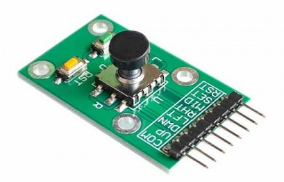
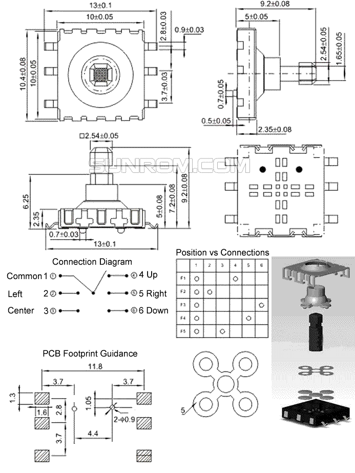

This board:



have a component which is just called a "5 way tactile switch" and
two buttons (`RST` and `SET`)

The best diagram I could find of the component is this:


[Source](https://www.sunrom.com/p/5-way-tactile-switch-10x10x9mm)

It's a switch that can connect the `COM` (or **common**) pin with 5 output
pins (*Up,Down,Left,Right,Center*)

The board contains 8 pins:
* `COM` which is the input common voltage
* `UP` output set to `COM` when you click over the `U` label in board
* `DWN` output set to `COM` when you click over the `D` label in board
* `LFT` output set to `COM` when you click over the `L` label in board
* `RHT` output set to `COM` when you click over the `R` label in board
* `MID` output set to `COM` when you click (or "center" click)
* `SET` output set to `COM` when you click the `SET` button
* `RST` output set to `COM` when you click the `RST` button

The operation of this is very simple, you can set the `COM` into either
`5V` or `GND` from Arduino, but will be easier to set to `GND` and
set the input pins as `INPUT_PULLUP` to avoid floating values.

For this I'm using `PORTB` (pins 8-12) as input for the 5 way switch
and pins 6 and 7 for `RST` and `SET` buttons.

To make it simpler code it will just set the `PORTB` into inputs and
pull-ups instead call `pinMode` for each pin:
```
// set pins 8-12 as input
DDRB &= ~0x1F;

// set input pull-ups
PORTB = 0x1F;
```

The example will print all the buttons that was pressend in each
cycle of 100ms, for example (removed repeated values):
```
RIGHT UP
UP
LEFT UP
LEFT DOWN
DOWN
RIGHT DOWN
CENTER
SET
RST
```