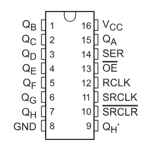
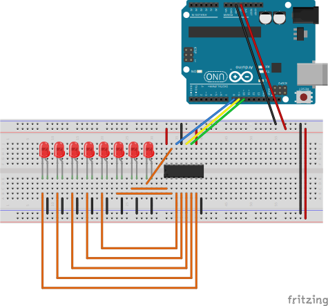

## Introduction
The 74LS595 is serial input to 8 bit output. This chip is commonly used for Seven Segment LED Displays

## Pinout

You have 2 clocks, one for displaying the output (`RCLK`) and other for storing serial data:
`SRCLK`

There is an `OE` which allow the output in the ports or high state if disabled, in this
example is always enabled set to `GND`.

The `SRCLR` is a master clear of the serial flip flops, this is always disabled in the example
connected to `VCC`

`SER` is the input serial to be stored in the flip-flops, each time a `SRCLR` happens it will
move `SER` into `QA` and move previous data to `QB`, `QC` and so on

The `QA` to `QH` are the output pins, with `QA` the last data sent through `SER` 
(LSB if you send a byte) and `QH` is the first data you sent (MSB if you send a byte)

## Breadboard Setup

The example will light the leds going from `0x00` to `0xFF` generating a counter.
The loop is very simple:
* Set `RCLK` off (no output)
* Send all bits through `shiftOut`
* Set `RCLK` on (show output)

There is also code similar to `shiftOut` so it can be show in detail how the 
serial part works:
* Put the `MSB` of value in the `SER` pin
* Set `SRCLK` off
* Set `SRCLK` on (store the `SER` value in first flip-flop and shift the others)
* Shift by one the value

## Datasheet

https://www.ti.com/lit/ds/symlink/sn74hc595.pdf