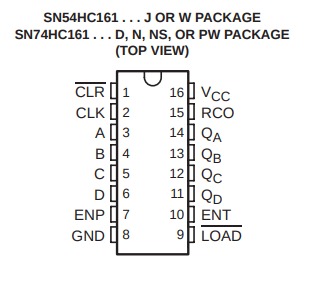

# 74HC161 Tester

The `74HC161` is a 4-bit synchronous binary counter

The counter will go from `0x0` to `0xF` using 4 outputs:
`QA`, `QB`, `QC` and `QD`

`D` is the `MSB` (Most Significant Bit) and `A` is the `LSB`
(Least Significant Bit)

## Initial Value

This IC supports setting an initial value using `A`, `B`, `C` and `D`
pins, needs to set `LOAD` pin to `LOW` to allow storing the value.

In the example it will load `0xC`, `12` in decimal or `1100` in binary,
in the `setup()` function

## Enabling Operation

There are two inputs for enabling operation: `ENT` and `ENP`, in this
example only is allowed to use `ENP`, `ENT` is kind of a master enable
it will allow `ENP` to decide increasing the counter
and also will allow the Carry output.
The `ENT` signal is set to `VCC` so will be always enabled.

`ENP` allows to update internal Flip-Flops, meaning will increase
counter, in this example it will be allowed in `setup()` function.

## Carry Output
When output reaches `0xF` or `A=B=C=D=1` it will set `RCO` pin to `HIGH`
level, this allow to chain other counters (datasheet shows to connect `RCO`
to `ENT` in the other counter so second counter will increase only when a
Carry Output happens in first counter)

## Pinout


## Breadboard Setup


## Arduino Serial Output Example
```
QA: 0, QB: 0, QC: 0, QD: 0, RCO: 0
QA: 1, QB: 0, QC: 0, QD: 0, RCO: 0
QA: 0, QB: 1, QC: 0, QD: 0, RCO: 0
QA: 1, QB: 1, QC: 0, QD: 0, RCO: 0
QA: 0, QB: 0, QC: 1, QD: 0, RCO: 0
QA: 1, QB: 0, QC: 1, QD: 0, RCO: 0
QA: 0, QB: 1, QC: 1, QD: 0, RCO: 0
QA: 1, QB: 1, QC: 1, QD: 0, RCO: 0
QA: 0, QB: 0, QC: 0, QD: 1, RCO: 0
QA: 1, QB: 0, QC: 0, QD: 1, RCO: 0
QA: 0, QB: 1, QC: 0, QD: 1, RCO: 0
QA: 1, QB: 1, QC: 0, QD: 1, RCO: 0
QA: 0, QB: 0, QC: 1, QD: 1, RCO: 0
QA: 1, QB: 0, QC: 1, QD: 1, RCO: 0
QA: 0, QB: 1, QC: 1, QD: 1, RCO: 0
QA: 1, QB: 1, QC: 1, QD: 1, RCO: 1
```

## Links
* [Datasheet](https://www.ti.com/lit/ds/symlink/sn54hc161.pdf)
