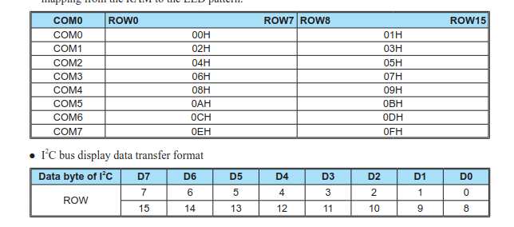
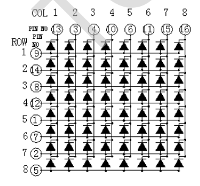
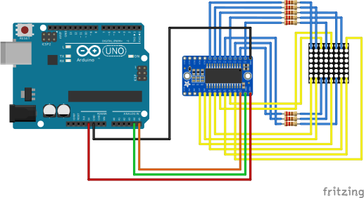

# HT16K33 16x8 LED Controller

This controller allows to control several modules, for a 8 segment digit module, can control up to 16 digits.
For a 8x8 LED module it can control up to two.

The commands are through I2C and has controls for:
* **On/Off** (`CMD_SETUP`)
* **Display** On/Off and optional blink settings (`CMD_DISPLAY`)
* **Dim** Up to 16 levels (`CMD_DIM`)

The controller has up to 16 registers:

Each register controls either the `ROW0-7` or the `ROW8-15`
In this example it will only be used a `8x8` 788bs module, so only needed the `ROW0-7`
or the even registers.

There are two ways to access the registers:
* **Single access** it needs to be set the address register and the data to write
* **Page access** it needs to set the first address register and all the data
to write sequentially.

In the example is going to be used the **Page access** but since there is nothing
connected to `ROW8-15` that data will be always be `0`.

## 788bs

There are several modules similar to this, it have a 8x8 leds and also 2 rows of
8 pins, one at the bottom (where code is printed) and the other at top.

Similar to IC, it must be counted the pins 1-8 on bottom, left to right,
and pins 9-16 on top, right to left.

Now here is the tricky part, for this specific model, the columns are **cathodes**,
`GND` or `COM` pins for HT16K33.
The rows are **anodes**, `VCC` or `ROW` pins for HT16K33.

Still it needs to be checked the pinout:

It will show the `ROW` and `COL` number and inside a circle  the **pin** in the module.
So for example the `ROW 1` is the **pin 9** (top, first at the right).

So the **cathodes** will be connected to `COM0-7` pins but needs to be added a `220`
resistor to prevent burning the led.
The **anodes** will be connected to `ROW0-7` pins.

## Schematic

Here is the schematic, most of the connections are between the HT16K33 module and the
788bs Module

## Example

The example needs a matrix of 16 bytes to use all registers.
Since there is only `ROW0-7` connected, the odd bytes will be set to 0.

The first part will be showing a "cascade" setting on all the leds progressively, will start
with first column and first row and will setting on all the rows in the first column, second
and so on.

Later will create some matrix art showing a heart. But note that this will be rotated by
90 degrees, this is beccause the rows are the data set in the module and the 788bs is a
row anode.
So the solution could be to rotate the module to make it work.

### Datasheets
* [HT16K33 16x8 LED Controller](https://cdn-shop.adafruit.com/datasheets/ht16K33v110.pdf)
* [788bs 8x8 LED](https://wiki.amperka.ru/_media/%D0%BF%D1%80%D0%BE%D0%B4%D1%83%D0%BA%D1%82%D1%8B:troyka-led-matrix:troyka-led-matrix_788bs_datasheet.pdf)