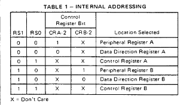
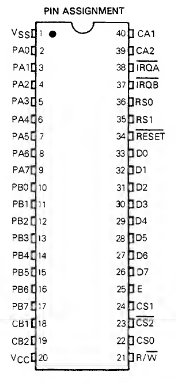
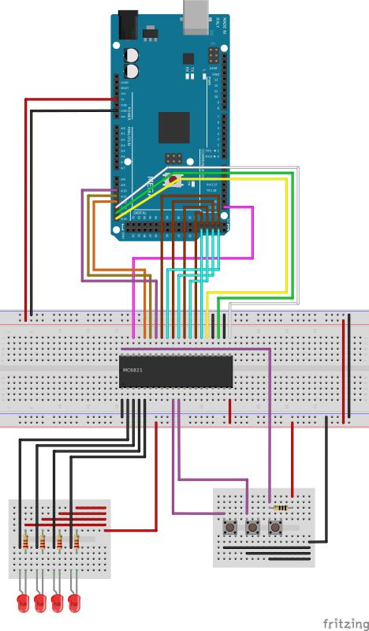

## Introduction
The MC6821 is a PIA for the 6800, but also was used for the 6502 and other cpus, for the 6502 it was 
named 6521; there are a lot of manufacters for this and all chips should be compatible.

The PIA has two ports that can be enabled for input or output, also have two interrupt lines for
each port (`CA1` and `CA2` for `Port A` and `CB1` and `CB2` for `Port B`)

There was three lines to select the chip and an `E` (Enable) pin.

The `E` is actually a clock input.

## Addressing

The `RS0` and `RS1` will select the proper address; with this we can select:
* `RS0=0, RS1=0 PORT A`
* `RS0=1, RS1=0 CONTROL PORT A`
* `RS0=0, RS1=1 PORT A`
* `RS0=1, RS1=1 CONTROL PORT B`

The `PORT` can be set for `DDR` (Direction Register) or `DATA` register, this will depend on the
`bit2` of `CONTROL PORT` register, if `bit2=0` (default) will be the `DDR` and if `bit2=1` then 
will be the `DATA`

## Pinout


## Breadboard Setup


This example will use the MEGA 2560 Board to make easier to read the full port for the `D0-D7`
Note that this needs 15 pins so the Uno Board can be enough, but code will be much more verbose.

The code will set the PORT B as output and will show a counter with 4 leds going from all leds on
to all leds off and repeat, each changing each second.

The PORT A is an input and when you press any of the first two buttons will show something like:
```
Read port: FE // first button pressed
Read port: FD // second button pressed
Read port: FC // two buttons pressed
```

The PORT A is pull-up and the buttons are connected to GND to change input

The third button is to enable interrupt. Note that code is enable the interrupt, 
but I wasn't able to make it work on my setup; probably has something to do with not 
using a regular clock to drive all operations.

## Datasheet

https://archive.org/details/Motorola_MC6821_NMOS_Peripheral_Interface_Adapter_1985_Motorola