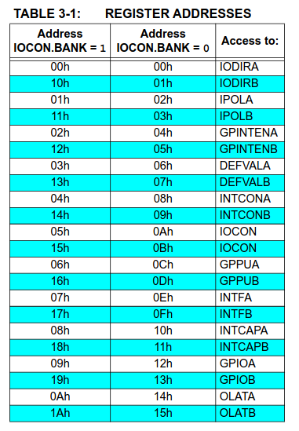
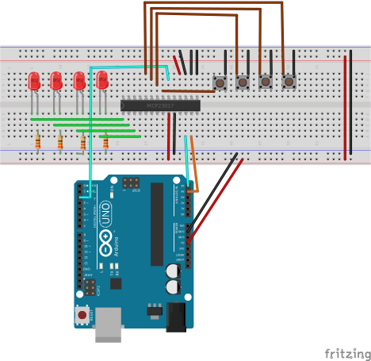

## Introduction
The MCP23017 is a two 8 bit port expander; any of the pins in the ports can be set to input or output.
Also have an interrupt line for each port.

The communication is through I2C protocol.

## Address configuration
The `A0-A2` pins can be set for 8 different address, the base address is: `0x20` so the address 
of the device is `0x20 | ADDR` where `ADDR` is the `A0-A2`, so can range from `0x20-0x27`

## Sequential mode
The default mode is sequential, meaning after each read it will go into next register, so this needs 
to be disabled to make it easier to handle.

## Registers
The device has a list of registers and their addresses, the list is:

The address depends on the `IOCON.BANK` by default this will be `IOCON.BANK=0` so if you want to 
access the Direction Register for Port B (`IODIRB`) the register will be the `01h` 
the register is 8 bits and the datasheet provide descriptions for each one.

The most important are:
* `IOCON` is the configuration register, is needed to disable the sequential mode.
* `IODIRx` which set input (1 level) or output (0 level) for port pins
* `GPIOx` which you can read (input pins) or write (output pins)
* `GPINTENx` will enable the interruption on certain pins of port, but can be needed `INTCONx` and `DEFVALx`

## Register Write

The write operation is very simple, you need:
* Set the address of the device with `Wire.beginTransmission`
* Write the address of the register with `Wire.write`
* Write the value of the register with `Wire.write`
* Finish transmission with `Wire.endTransmission`

The example code has a function called `writeRegister(DEVICE_ADDRESS, VALUE)`

## Register Read

This is similar to write, but instead of writing the value, will be needed to ask `Wire`
library to get one byte of data, so the steps are:
* Set the address of the device with `Wire.beginTransmission`
* Write the address of the register with `Wire.write`
* Finish transmission with `Wire.endTransmission`
* Set the address of the device with `Wire.beginTransmission`
* Request one byte with `Wire.requestFrom`
* Call to `Wire.read`

The example code has a function called `readRegister(DEVICE_ADDRESS)`

## Breadboard Setup

The setup is simple, `PORTA` is an input through buttons, `PORTB` is output through leds.
By default each 1 second will go from `0xF` to `0x0` in the leds, so will start showing all leds
on (0xF), later will show first three (from left to right) on (0xE) and so on.

When you click on the buttons it will generate an interrupt and print in the serial 
what combination of buttons has been pressed (`0x0` to `0xF`). This will generate an interrupt 
and as there is no bounce mechanism the same combination can show several times.

To show more use of registers, the buttons are conencted to `GND` instead `VCC` so it will be
active low. To be able to trigger an interrupt the polarity of port (`IPOLA`) is inversed 
so a low value will be a high value internally. And the pull-up register (`GPPUA`) is set so
the active low will trigger a change.

## Datasheet

https://ww1.microchip.com/downloads/aemDocuments/documents/APID/ProductDocuments/DataSheets/MCP23017-Data-Sheet-DS20001952.pdf