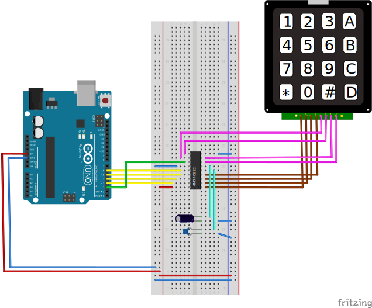

# MM74C922 Tester

The `MM74C922` is a 16-Key Encoder chip, it can be plugged to a
4x4 Keypad Matrix like [this](https://www.parallax.com/product/4x4-matrix-membrane-keypad/) or [this](https://www.adafruit.com/product/3844)

Those are very similar and have 8 pins, one for each row (4 rows) and other for
columns (4 columns).

There are several examples in Arduino on how to interact using 8 pins,
what you need to do is to go into each row and write a `HIGH` level and later
go into each column and read if there is a `HIGH` level to detect the
`Row,Column` intersection and check which button has been pressed,
you will need to add a debouncer function.

The `MM74C922` does all the work and reduces from 8 pins to 5 pins having
4 pins for data which contains the button pressed (`2^4 = 16` combinations that
is why the 16-Key encoder) and a pin `DATA AVAILABLE` which will be `HIGH`
when a button is pressed.

There is also an optional `OUTPUT ENABLE` pin which can be used to create
a 3-State output, in this example is just set to `GND` so always will send
data.

## Pinout

## Breadboard Setup

The capacitors in the setup are:
* 1uF Ceramic - Oscillator (Pin 5)
* 1uF Electrolytic - Keybounce Mask (Pin 6)

Note that datasheet just says those pins can be combined, but there
is no information or formulas on how to select properly.

# Note
Even most Keypads are similar and all have 8 pins, it can be possible
that combninations are not the same, so probably you need to change the
values in the `char value[]` to match the keypad you are using.

## Links
* [Datasheet](https://www.mouser.com/datasheet/2/308/MM74C922-1120961.pdf?srsltid=AfmBOoptqp6Bc8GEVA7Z5hT1drblv-84eKRfry6mMKO-qcLQOc8tgMFf)
